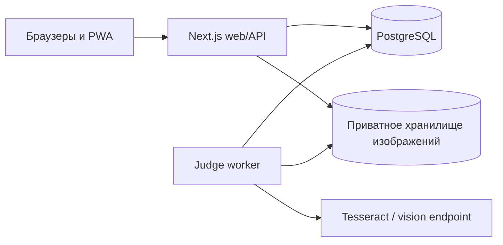

<div align="center">
  
  <h1>Mathforces</h1>
  <p>Математические контесты, проверка решений и устойчивый рейтинг в одном приложении.</p>
</div>

> Проект находится на стадии рабочего MVP и предназначен прежде всего для локального и ограниченного
> школьного пилота. Перед открытым интернет-релизом ознакомьтесь с разделом
> [«Ограничения»](#ограничения-mvp).

## Что уже работает

- регистрация, авторизация, организации и кастомизируемые профили;
- публичные и организационные контесты с 1–12 задачами;
- поздняя регистрация, предварительный рейтинговый посев и live-таблица;
- фото-посылки, локальный OCR, очередь автоматической проверки и ручная модерация;
- повторная проверка последних решений после финиша и автоматический расчёт рейтинга;
- архив задач с тематическим колесом, комментариями, лайками и тренировочными попытками;
- рейтинг участников и организаций, история изменений и графики в профиле;
- административная панель, журнал действий, мониторинг, FAQ и новости;
- адаптивный интерфейс, светлая/тёмная темы и устанавливаемая PWA в HTTPS-окружении.

Новый пользователь фактически имеет рейтинг `0`, но до первого рейтингового контеста в публичном
интерфейсе видит `—`.

## Стек

| Слой           | Технологии                                                                           |
| -------------- | ------------------------------------------------------------------------------------ |
| Web            | Next.js 16, React 19, TypeScript, Tailwind CSS 4                                     |
| Данные         | PostgreSQL 17, Prisma 7                                                              |
| Фоновые задачи | отдельный Node.js worker и очередь в PostgreSQL                                      |
| Проверка       | Tesseract OCR, локальные эвристики, необязательный OpenAI-compatible vision endpoint |
| Инфраструктура | Docker Compose, GitHub Actions, PWA/service worker                                   |

## Быстрый локальный запуск

Потребуются Node.js 24+, npm 11/12, Docker с Compose и, для локального OCR, Tesseract.

```bash
cp .env.example .env
npm ci
docker compose up -d postgres
npm run dev
```

Откройте [http://localhost:3000](http://localhost:3000). Команда `npm run dev`:

1. применяет существующие миграции Prisma;
2. запускает Next.js;
3. запускает worker проверки и автоматического жизненного цикла контестов.

Если база не отвечает за 30 секунд, запуск останавливается с понятной ошибкой вместо бесконечного
ожидания.

## Тестирование с нескольких устройств

Подключите компьютер и телефоны к одной доверенной Wi-Fi/LAN-сети, затем выполните:

```bash
npm run dev:lan
```

Команда привязывает только web-приложение к `0.0.0.0` и выводит адрес вида
`http://192.168.1.25:3000`. Откройте именно его на остальных устройствах. PostgreSQL при этом
остаётся доступен только локально через `127.0.0.1:5432`.

Если автоматическое определение IP недоступно, найдите IPv4 компьютера:

```bash
ip -4 addr
```

Подробности для Linux, Windows и macOS, настройка firewall и типовые проблемы собраны в
[инструкции по LAN-тестированию](docs/local-network-testing.md).

> LAN-режим не предназначен для публикации в интернете. Не используйте port forwarding и не
> запускайте его в публичной Wi-Fi-сети.

## Тестовый контест

Команда создаёт либо продлевает один и тот же демонстрационный контест на шесть часов:

```bash
npm run db:seed:test-contest
```

Его постоянный адрес: `/contests/00000000-0000-4000-8000-000000000301`.

## Архитектура



Web-процесс принимает запросы и ставит проверки в очередь. Worker независимо обрабатывает посылки,
запускает и завершает контесты, следит за финализацией и продолжает работу после перезапуска
процесса. Изображения решений не раздаются как статические файлы: доступ проходит через
авторизованные API-маршруты.

### Логика автоматической проверки

- Во время контеста участник получает предварительный балл.
- После `endAt` worker повторно проверяет последнюю посылку каждого участника по каждой задаче.
- Уверенный результат становится финальным автоматически.
- Результат ниже настроенного порога уверенности остаётся предварительным для участников и попадает
  в заметную очередь администратора.
- После подтверждения последней спорной оценки автоматически продолжаются финализация, рейтинг и
  разрешённая публикация задач в архив.

Текущий локальный judge является воспроизводимой OCR/эвристической системой, а не доказательно
точным математическим экспертом. Для ответственного соревнования администратор должен проверять
сомнительные результаты и заранее откалибровать рубрики.

## Конфигурация

Все локальные настройки находятся в `.env`, который исключён из Git. Публичный шаблон —
[`.env.example`](.env.example).

Основные переменные:

| Переменная                | Назначение                                                |
| ------------------------- | --------------------------------------------------------- |
| `DATABASE_URL`            | строка подключения PostgreSQL                             |
| `SUBMISSION_STORAGE_DIR`  | приватная директория изображений                          |
| `TESSERACT_BINARY`        | путь или имя бинарника Tesseract                          |
| `TESSERACT_LANGUAGES`     | приоритет языковых наборов OCR                            |
| `MATHFORCES_LLM_*`        | необязательный OpenAI-compatible vision endpoint          |
| `SESSION_COOKIE_SECURE`   | ручное управление Secure cookie для особой инфраструктуры |
| `NEXT_PUBLIC_SUPPORT_URL` | публичная ссылка поддержки в FAQ                          |

Никогда не коммитьте `.env`, API-ключи, дампы БД, папку `storage` или реальные решения участников.

## Команды разработчика

| Команда                  | Назначение                                      |
| ------------------------ | ----------------------------------------------- |
| `npm run dev`            | web + worker на localhost                       |
| `npm run dev:lan`        | web + worker с доступом из доверенной LAN       |
| `npm run check`          | форматирование, ESLint, TypeScript и unit-тесты |
| `npm run build`          | production-сборка                               |
| `npm run security:audit` | аудит npm-зависимостей                          |
| `npm run test:smoke`     | HTTP smoke-тест запущенного приложения          |
| `npm run test:queue`     | изолированный тест очереди в PostgreSQL         |
| `npm run test:cycle`     | полный цикл контеста, финализации и рейтинга    |
| `npm run test:integrity` | проверка целостности рабочей БД                 |
| `npm run backup:create`  | локальный дамп PostgreSQL                       |

Полный список находится в [`package.json`](package.json).

## Docker-пилот

Для закрытого пилота на одном VPS подготовлен production Compose:

```bash
docker compose -f docker-compose.production.yml up --build -d
```

До запуска задайте безопасный `POSTGRES_PASSWORD` и `DATABASE_URL`, где host равен `postgres`.
Compose отдельно запускает миграции, web и worker, а данные сохраняет в volumes.

## Ограничения MVP

Перед открытым интернет-релизом необходимы:

- HTTPS reverse proxy и проверенная политика Content Security Policy;
- off-host резервные копии с регулярным тестом восстановления;
- объектное хранилище для приватных изображений;
- почтовый провайдер для самостоятельного восстановления пароля;
- полноценное наблюдение за ошибками и метриками;
- нагрузочное тестирование и калибровка judge на реальных размеченных решениях.

## Документация

- [локальное LAN-тестирование](docs/local-network-testing.md);
- [архитектура Sprint 0](docs/sprint-0-architecture.md);
- [производительность и автоматизация](docs/performance-and-automation.md);
- [техническая передача MVP](docs/mvp-technical-handoff.md);
- [релизная готовность](docs/sprint-10-release-readiness.md);
- [история спринтов](docs/).

Правила участия в разработке описаны в [CONTRIBUTING.md](CONTRIBUTING.md), сообщения об уязвимостях
— в [SECURITY.md](SECURITY.md).

## Лицензия

Лицензия пока не выбрана. До появления файла `LICENSE` исходный код нельзя автоматически считать
свободным для копирования, изменения или распространения. Решение о лицензии принимает владелец
репозитория.
